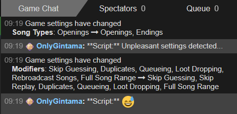
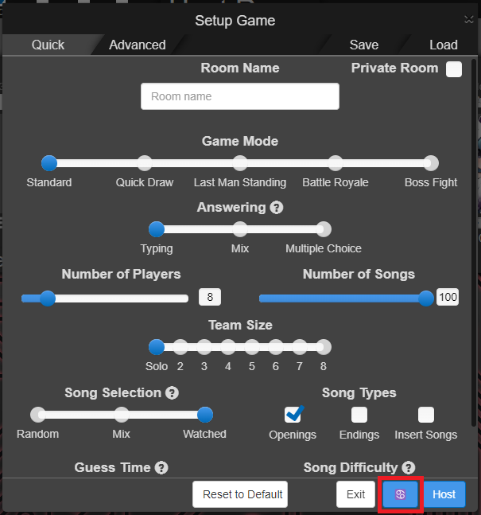

# Script description

An userscript for AMQ that automatically look for unpleasant lobby settings and modify them if needed.

In the next example, when the host modifies the settings to include Endings in the song types, the script detects that some modifiers are unpleasant and modifies them accordingly:

    

Unpleasant modifiers:

- Rebroadcast songs if ON.
- Dubs songs if ON.
- Skip guessing if OFF.
- Skip replay if OFF.

# Requirements

[Tampermonkey](https://www.tampermonkey.net/) (or any other alternative option) for installing the AMQ script.

# How to use

The script automatically modify the lobby settings, so the player doesn't need to do anything in order to make this work.

However, the player is free to turn off the script from in-game so the settings are not modified anymore by clicking on the "Cancer" button that can be found in the footer of the lobby settings modal:

    

The script checks the settings (and modifies them if procceed) when:

- The lobby is created.
- The settings are modified by the host (if they are using this script).
- The player using this script is promoted to host while in lobby (not during game).