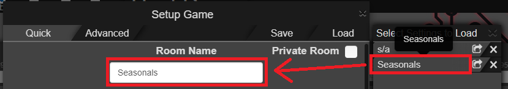

# Scripts

A set of independent userscripts for AMQ that make hosting a lobby a couple of seconds faster.

## AMQ Room Name and Password Autosetters

Automatically set the room's name and password (if any) to the last ones you used so that you don't have to write them again each time you host a new lobby.

## AMQ Room Name from Saved Settings

When loading the lobby's settings from the saved settings panel (not from code), automatically updates the room's name with the one used for storing the selected settings.

    

# Requirements

[Tampermonkey](https://www.tampermonkey.net/) (or any other alternative option) for installing the AMQ script.