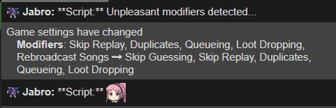
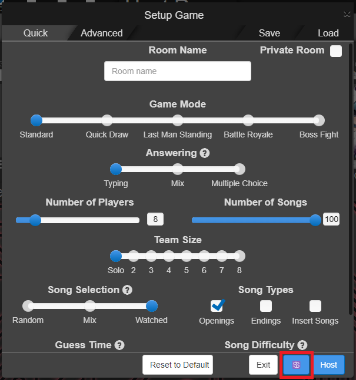

# Scripts

A set of independent userscripts for AMQ that make hosting a lobby a couple of seconds faster.

## AMQ Room Name and Password Autosetters

Automatically set the room's name and password (if any) to the last ones you used so that you don't have to write them again each time you host a new lobby.

## AMQ Room Name from Saved Settings

When loading the lobby's settings from the saved settings panel (not from code), automatically updates the room's name with the one used for storing the selected settings.

    

## AMQ Cancer Removal

Automatically look for unpleasant lobby modifiers and modify them if needed.

    

Unpleasant modifiers (default):

- Rebroadcast songs if ON.
- Dubs songs if ON.
- Full song range if ON.
- Skip guessing if OFF.
- Skip replay if OFF.

The script checks the settings (and modifies them if procceed) when:

- The lobby is created.
- The settings are modified by the host (if they are using this script).
- The player using this script is promoted to host while in lobby (not during game).

### Turning off the script from in game

The player is free to turn off the script from in-game so the settings are not modified by the script anymore by clicking on the "Cancer" button that can be found in the footer of the lobby settings modal:

    

### Modifying script behavour

The user can change which are the "unpleasant" modifiers from the script code. Look for `const modifiers` inside the script.

# Requirements

[Tampermonkey](https://www.tampermonkey.net/) (or any other alternative option) for installing the AMQ script.