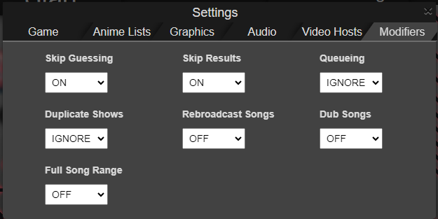

# Scripts

A set of independent userscripts for AMQ that make hosting a lobby a couple of seconds faster.

## AMQ Room Name and Password Autosetters

Automatically set the room's name and password (if any) to the last ones you used so that you don't have to write them again each time you host a new lobby.

The script remember the room's name and password even when you reload/logout from AMQ as it uses cookies to store these values. 

## AMQ Room Name from Saved Settings

When loading the lobby's settings from the saved settings panel (not from code), automatically updates the room's name with the one used for storing the selected settings.

    

## AMQ Auto Modifiers

Automatically look for unpleasant modifiers when hosting a lobby and change their values if needed.

    

You can configure which modifiers are considered unpleasant from the game's main settings modal:

    

The possible values of a modifier are:
- `ON`: Always make sure that the modifier is active (turn it on if not).
- `OFF`: Always make sure that the modifier is not active (turn it off if not).
- `IGNORE`: Do not change the modifier value.

> [!NOTE]
> By default, all modifiers are set to `IGNORE`, meaning that this script is useless unless you go to settings and customize your unpleasant modifiers.

> [!NOTE]
> The script uses cookies to remember your unpleasant modifiers configuration for future sessions, meaning that you only need to configure it once (unless you remove the cookies from your web browser).

The script looks for unpleasant modifiers (and change their value if procceed) when:

- The lobby is created.
- The settings are modified by the host (if they are using this script).
- The player using this script is promoted to host while in lobby (not during game).

# Requirements

[Tampermonkey](https://www.tampermonkey.net/) (or any other alternative option) for installing the AMQ script.