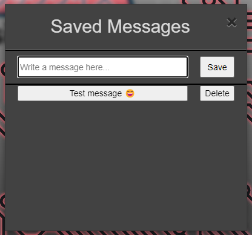

# Script description

An userscript for AMQ that allow the player to save custom messages and, once they are clicked, autosend them to game chat:

    

# Requirements

[Tampermonkey](https://www.tampermonkey.net/) (or any other alternative option) for installing the AMQ script.

# How to use

- Open the `Saved Messages` window:

    - You can either open the window through an in-game button.
    

        
    

    - Or through the options container at any moment (no need to be playing).
    

        
    

- You can write messages in the text field of the first panel and save them for future sessions by clicking on the "Save" button:

    

- Once the save button is clicked, the message will be stored in the second panel, allowing you to autosend the saved message when clicking on it or delete the saved message:

    

For more information, check the GIF from the beginning of this document.