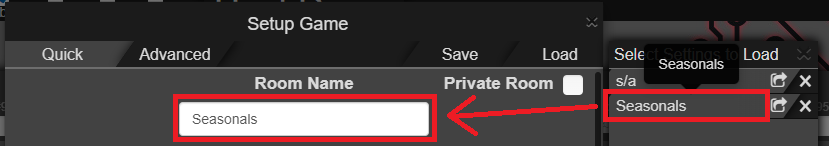

# Script description

An userscript for AMQ that automatically modify the room name when loading lobby settings from saved settings:

    

# Requirements

[Tampermonkey](https://www.tampermonkey.net/) (or any other alternative option) for installing the AMQ script.

# How to use

Simply select the settings to load as you would normally do (loading from saved settings, not code) and the room name will automatically be updated with the saved settings' name.