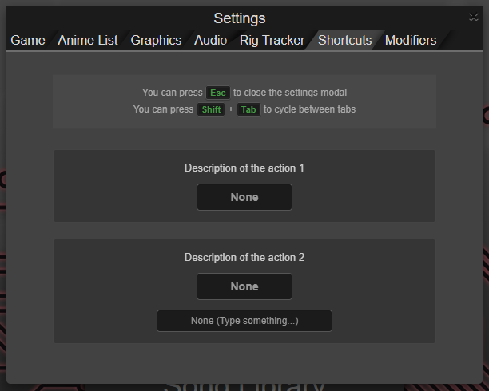
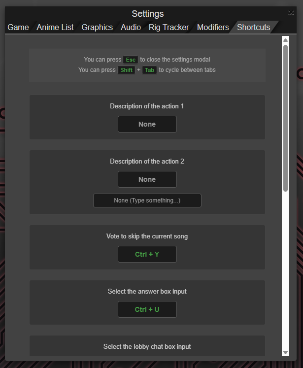

<p align="right">
  <a href="./README.md">Overview</a> | <a href="./SHORTCUTS.md">Keyboard Shortcuts Reference</a> | <b>Developer Guide</b>
</p>
<hr />

# How to create your own shortcuts

You can reference `AMQShortcutsCore.js` to add custom keyboard shortcuts to AMQ.

Template:

```javascript
// ==UserScript==
// @name         My Custom Shortcuts
// @version      0.1
// @description  Some shortcuts to improve the game experience
// @author       You
// @match        https://*.animemusicquiz.com/*
// @grant        none
// @require      https://raw.githubusercontent.com/JabroAMQ/Utilities/main/AMQ/Shortcuts/AMQShortcutsCore.js
// ==/UserScript==

// Define UI descriptions for your shortcuts
const descriptions = {
    customAction1: 'Description of the action 1',
    customAction2: 'Description of the action 2',
};

// Map your shortcuts configurations
// You must provide the function reference in the callback property (examples below)
// You may add an optional `renderExtraInfo` key in case your functionality requires extra persistent data
const shortcuts = [
    { id: 'customAction1', callback: customAction1, description: descriptions.customAction1 },
    { id: 'customAction2', callback: customAction2, description: descriptions.customAction2, renderExtraInfo: customAction2ExtraInfo },
];

// Optional persistence in case you need to save extra data
// Check `customAction2ExtraInfo()` to see its utility
let customAction2Data = localStorage.getItem('AMQ_CustomAction2_Data') ?? null;


// Typical AMQ userscript initialization
if (document.getElementById('loginPage')) return;
const DELAY = 300;
const loadInterval = setInterval(() => {
    if ($('#loadingScreen').hasClass('hidden')) {
        clearInterval(loadInterval);
        loadShortcuts();
    }
}, DELAY);


// Do not modify this function
function loadShortcuts() {
    if (!window.ShortcutsManager) {
        console.error("ShortcutsManager library could not be loaded via @require.");
        return;
    }

    shortcuts.forEach(shortcut => {
        window.ShortcutsManager.register({
            id: shortcut.id,
            description: shortcut.description,
            callback: shortcut.callback,
            renderExtraInfo: shortcut.renderExtraInfo // Optional UI extension
        });
    });

    window.ShortcutsManager.init();
}

// Define your custom functions matching the `callback` names in the `shortcuts` list
function customAction1() {
    console.log("Custom Action 1 executed!");
}

function customAction2() {
    console.log("Custom Action 2 executed!");
    if (customAction2Data) {
        console.log(customAction2Data);
    }
}

// Optional UI Extensions
// Appends a custom text input field directly underneath the shortcut row in Settings
function customAction2ExtraInfo(row) {
    /*
        Do not modify the next classes if you want to keep the CSS style
        - amq-shortcut-extra-container
        - amq-shortcut-extra-input
    */
    const customAction2Container = $('<div></div>').addClass('amq-shortcut-extra-container');

    const customAction2Input = $('<input>')
        .attr('type', 'text')
        .attr('tabindex', '-1')
        .addClass('form-control text-center amq-shortcut-extra-input')
        .val(customAction2Data ?? '')
        .attr('placeholder', "None (Type something...)");

    customAction2Input.on('input', function() {
        const value = $(this).val().trim();

        // Make sure to use the same name as the one defined earlier (`let customAction2Data = ...`); in this case, `AMQ_CustomAction2_Data`
        if (value === '') {
            customAction2Data = null;
            localStorage.removeItem('AMQ_CustomAction2_Data');
        } else {
            customAction2Data = value;
            localStorage.setItem('AMQ_CustomAction2_Data', value);
        }
    });

    customAction2Container.append(customAction2Input);
    row.append(customAction2Container);
}
```

Let's breakdown some important stuff

## Shortcut structure
| Property | Type | Required | Description |
| :--- | :--- | :--- | :--- |
| `id` | `string` | **Yes** | A unique string identifier for your action. |
| `description` | `string` | **Yes** | The descriptive label displayed to the player in the Settings tab. |
| `callback` | `function` | **Yes** | The JavaScript function executed when the registered hotkey is pressed. |
| `renderExtraInfo` | `function` | No | A hook function providing access to the UI row element for advanced custom UI injections. |

## renderExtraInfo (optional property)
The core is highly flexible. If your shortcut requires configuration data (like a target friend's username, a custom room ID, or toggle parameters), you can use the `renderExtraInfo` hook.

As shown in the `customAction2ExtraInfo(row)` example:
1.  The core passes the jQuery object of the shortcut HTML table row (`row`).
2.  You can use standard jQuery syntax (`$('<input>')`) to create custom text fields, checkboxes, or sliders.
3.  You can hook event listeners (`'input'`, `'change'`) onto your custom fields to save the configuration directly into `localStorage`.

# Results

`AMQShortcutsCore.js` allows you to create as many independent shortcuts userscripts as you want.

After creating your userscript, your custom shortcuts will be added to the Shortcuts tab in the Settings modal.

If this is your only "shortcuts userscript", the Shortcuts tab will look like this:



If you have more than one, the shortcuts from all the userscripts will be displayed:

