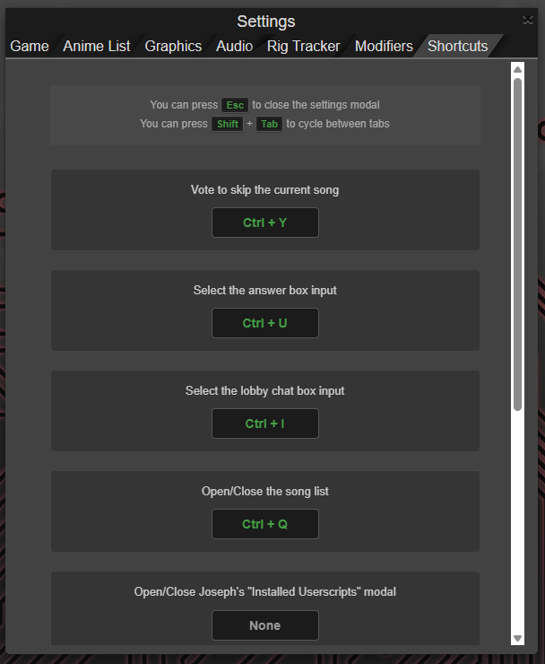
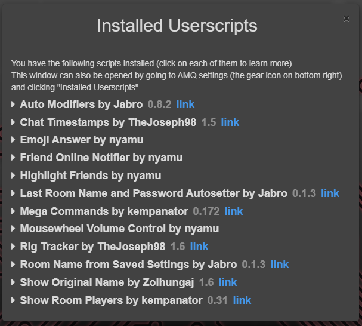
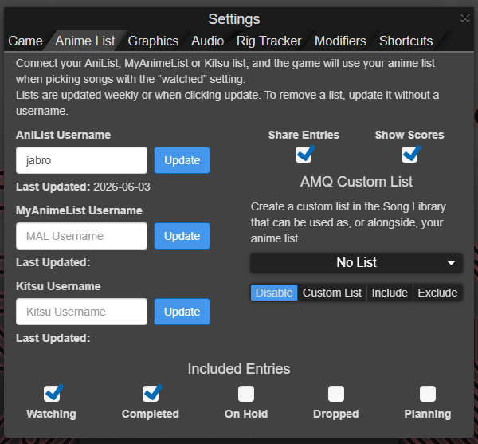
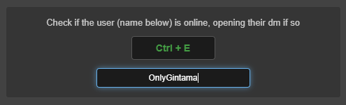
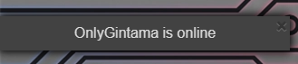

  <b>Overview</b> | <a href="./SHORTCUTS.md">Keyboard Shortcuts Reference</a> | <a href="./DEVELOPER.md">Developer Guide</a>

# AMQ Custom Shortcuts

A customizable keyboard shortcuts userscript for AMQ to streamline your gameplay, chat, and navigation.

You can bind your own custom `Ctrl + Key` combinations directly within the new **Shortcuts** tab inside the Settings modal.

> [!WARNING]
> You cannot bind the same key to two different actions. The game will alert you if a key is already in use.

> [!NOTE]
> You can unbind a key by using `Backspace` or `Delete` keys.

> [!TIP]
> Need inspiration? Check out [SHORTCUTS.md](SHORTCUTS.md) for recommended key setups.

## Available shortcuts:

### Vote to skip the current song

Simulate a click on the "VoteSkip" button in game

### Select the answer box input

Simulate a click on the answer box input, allowing you to start writing an answer immediately

### Select the lobby chat box input

Simulate a click on the lobby chat box input, allowing you to start writing a message immediately

### Open/Close the song list

Open the built-in song list modal if it is closed, or close it otherwise.

Can be used everywhere inside AMQ, you don't need to be playing a game for it to work.

### Open/Close Joseph's "Installed Userscripts" modal

Open TheJoseph98's Installed Userscripts modal if it is closed, or close it otherwise
 

Probably only useful for debugging purposes while creating your own userscript.

### Open the Anime List tab from the Settings modal

Open the Anime List tab from the Settings modal
 

> [!NOTE]
> If it is already opened, it doesn't close it. You can close it using `Escape` instead.

> [!TIP]
> You can cycle between tabs inside the Settings modal using `Shift + Tab`.

### Open the Shortcuts tab from the Settings modal

Open the Shortcuts tab from the Settings modal
 

> [!NOTE]
> If it is already opened, it doesn't close it. You can close it using `Escape` instead.

> [!TIP]
> You can cycle between tabs inside the Settings modal using `Shift + Tab`.

### Check if the user (name below) is online, opening their dm if so

Niche shortcut to open the DM of a specific player.

You can configure who is that player from the Shortcuts tab in the Settings modal
 

Its only real utility is in combination with Nyamu's [FriendOnlineNotifier](https://github.com/nyamu-amq/amq_scripts/blob/master/amqFriendOnlineNotifier.user.js) userscript, for easily instayapping with them once they go online
 

# Requirements

[Tampermonkey](https://www.tampermonkey.net/) (or any other alternative option) for installing the AMQ script.
