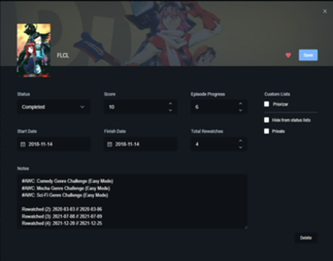
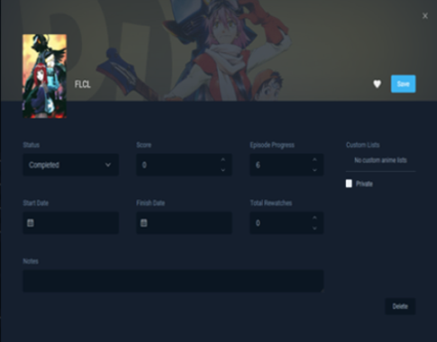
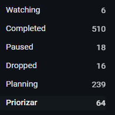
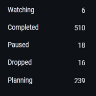
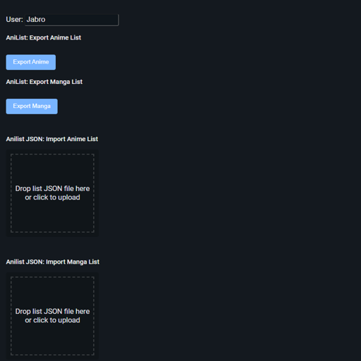

# Script description

Given a JSON with the data from an **anime list** (not manga) obtained as a result of exporting an Anilist's anime list using automail, cleans some media fields so that the anime list can be reimported or imported to another anilist account without the cleaned data.

It is recommended that even if you want to reimport the data in your original account, to import it in a different one to make sure you are not cleaning some info that you would like to keep.


# Cleaned data

This script will remove all your custom lists and, for each anime, the next data:

- Score
- Progress (episodes)
- Start and Finish dates
- Number of rewatches
- Notes
- When the anime was added to the list and when was the last time it was updated by the user


**Figure 1:** Media example before cleaning vs after cleaning
<p float='center'>
  
  
</p>


**Figure 2:** Lists example before cleaning vs after cleaning ("Priorizar" custom list was removed)
<p float='center'>
  
  
</p>


# Requirements

Python3.9+


# How to use

- Install [automail](https://greasyfork.org/en/scripts/370473-automail) if you don't have it yet

- Go to https://anilist.co/settings/import and scroll untill you see the section from Figure 3


**Figure 3:** Importing / Exporting an anime list in Anilist using automail
<p float='center'>
  
</p>


- Click on "Export Anime" (see Figure 3)

- Modify [AnilistAnimeList.json](AnilistAnimeList.json) with the JSON you just downloaded

- Execute the script in your terminal, which will overwrite the JSON in the [Output](Output) subdirectory:

```
python main.py
```

- Import the JSON from the [Output](Output) subdirectory ("Anilist JSON: Import Anime List - Drop list JSON file here or click to upload" in Figure 3)